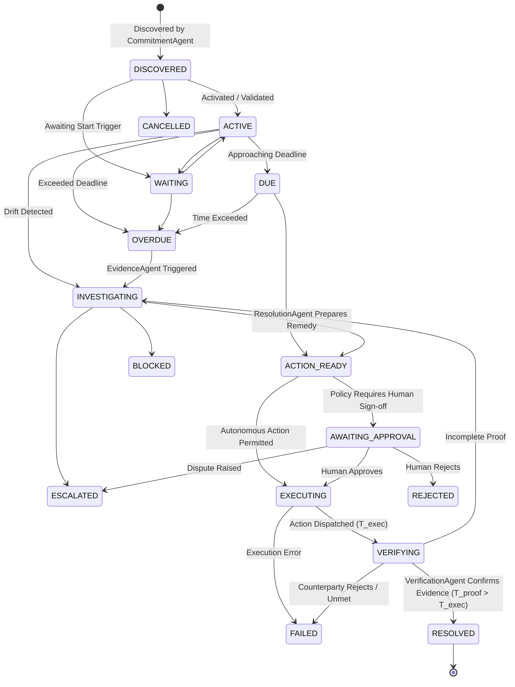

# Covenant Architecture & System Design

> **"A task tells you what to do. A commitment tells you what the world expects to happen. Covenant watches whether that expectation is actually fulfilled."**

---

## 1. System Overview

Covenant is an autonomous commitment-resolution agent system built for professionals, consultants, and agencies. It continuously monitors what organizations and individuals have promised, evaluates drift, coordinates evidence across disparate sources, proposes authorized remedies under strict policy guardrails, requires human sign-off for sensitive operations, and independently verifies post-action resolution before marking commitments complete.

### Core Architecture

```text
User / Operator
      │
      ▼
Covenant UI / API (FastAPI + React Vite GUI)
      │
      ▼
SupervisorAgent (Orchestration & Workflow Coordination)
      │
      ├── CommitmentAgent (Discovery & Structured Extraction)
      ├── EvidenceAgent (Corroboration, Gaps & Contradictions)
      ├── ResolutionAgent (Remedial Action Formulation)
      ├── PolicyAgent (Autonomy vs Approval Guardrails)
      └── VerificationAgent (Independent Proof Evaluation)
      │
      ▼
Strands Agents SDK (strands-agents 1.54.0)
      │  ├── Agent(model=..., tools=..., system_prompt=...)
      │  └── Native @tool Declarations & Model Protocol
      │
      ▼
Governed Agent Runtime
      │
      ├── Policy / Authorization Engine (Deterministic Guardrails)
      ├── Human Approval Gate (Mandatory for External / High-Risk)
      ├── Execution Engine (Controlled Dispatch at T_exec)
      ├── Idempotency Store (Duplicate & Replay Prevention)
      ├── Persistence Layer (SQLite WAL / Audit Event Log)
      └── VerificationGate (T_proof > T_exec Independent Verification)
      │
      ▼
External Tools & Enterprise Evidence
  (Email threads, MSA contracts, invoices, milestone trackers, vendor tickets)
```

---

## 2. Technology Stack

| Layer | Implementation / Technology | Purpose |
|---|---|---|
| **Frontend** | React 18 + Vite + Tailwind CSS | Real-time Commitment Map, They Owe / We Owe dashboard, Decision Surface |
| **API Backend** | FastAPI + Uvicorn + Pydantic v2 | REST API, operational monitoring control plane, SSE event streams |
| **Agent Framework** | **AWS Strands Agents SDK** (`strands-agents`) | Autonomous multi-agent coordination, `@tool` binding, streaming events |
| **Model Providers** | Pluggable Strands Model Protocol | Deterministic (offline/CI), Ollama (local LLM), Amazon Bedrock (native Strands) |
| **Governed Runtime** | Governed Agent Runtime | Deterministic state machine, authorization engine, human approval gate, verification gate |
| **Persistence** | SQLite with Write-Ahead Logging (WAL) | ACID transactional store, audit event trail, idempotent execution log |
| **Evaluation Suite** | Deterministic Pytest Benchmark | 43 scenarios (25 baseline + 18 adversarial) measuring safety invariants |

---

## 3. Core Principles: Execution ≠ Fulfillment

Most enterprise automation stops when an action succeeds:
> "The email was sent, therefore the task is done."

Covenant enforces that **action execution does not equal commitment fulfillment**:

```text
EXECUTION ≠ FULFILLMENT

Action success (T_exec)
      ↓
does not automatically mean
      ↓
real-world obligation fulfilled

Fresh independent evidence (T_proof > T_exec)
      ↓
VerificationGate
      ↓
RESOLVED
```

### The Dual-Verification Invariant:
1. **Execution Proof ($T_{\text{exec}}$)**: Validates that the runtime dispatched the authorized tool cleanly (e.g. follow-up email sent).
2. **Outcome Verification Gate ($T_{\text{proof}} > T_{\text{exec}}$)**: Strictly requires fresh, independent documentary counterparty evidence timestamped after action execution. Pre-action evidence and stale replayed proofs are rejected. If counterparty rejects or proof is absent, Covenant remains in `VERIFYING` or marks `FAILED`—**never `RESOLVED`**.

---

## 4. Deterministic Commitment State Machine

The lifecycle of every commitment is governed by strict deterministic state transitions:



### Transition Invariants:
1. **Guard Conditions**: Cannot transition to `AWAITING_APPROVAL` without a concrete `ProposedAction`.
2. **Approval Enforcement**: Cannot transition to `EXECUTING` from `AWAITING_APPROVAL` unless `status == APPROVED` and `approved_by` is recorded.
3. **Replay Defense**: Cannot re-execute or bypass from `VERIFYING` back to `EXECUTING` without fresh cycle authorization.
4. **Independent Closure**: Cannot transition to `RESOLVED` unless `VerificationResult.is_verified == True` on fresh evidence.

---

## 5. Human-in-the-Loop Policy Boundary

Covenant applies deterministic, inspectable rules to classify actions:

| Action Category | Autonomy Classification | Rationale |
|---|---|---|
| **Workspace Scanning** | Autonomous | Read-only discovery across email, contracts, calendar |
| **Evidence Corroboration** | Autonomous | Cross-referencing records and milestones |
| **Risk & Deadline Computation** | Autonomous | Internal state evaluation |
| **Follow-Up Email to Client/Vendor** | **Human Approval Required** | External business communication requiring accountability (`RULE-EXT-COMM`) |
| **High / Critical Risk Actions** | **Human Approval Required** | Prevents unintended dispute escalation |
| **Financial / Contractual Notices** | **Human Approval Required** | Affects invoices, billings, or legal standings |

---

## 6. Directional Obligations ("They Owe / We Owe")

Covenant categorizes commitments by obligation direction:
- **`THEY_OWE_US`**: Promises made by clients, vendors, or contractors to Northstar Studio (e.g. client approvals, supplier shipments, technician repairs).
- **`WE_OWE_THEM`**: Commitments made by Northstar Studio to clients (e.g. deliverables, reports, brand kits).

This distinction drives priority, risk calculation, and remedy formulation across the operational surface.
