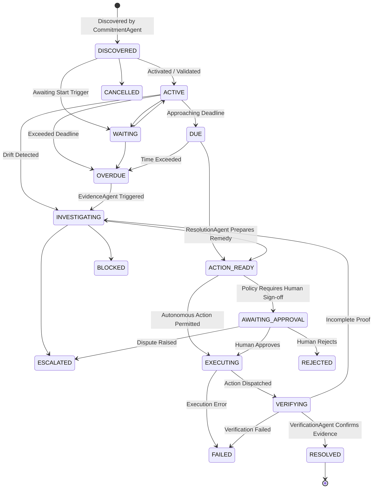

# Covenant Architecture & Product Design

> **"A task tells you what to do. A commitment tells you what the world expects to happen. Covenant watches whether that expectation is actually fulfilled."**

---

## 1. System Overview

Covenant is an autonomous commitment-resolution agent system built for professionals, consultants, and agencies. It continuously monitors what organizations and individuals have promised, evaluates drift, coordinates evidence across disparate sources, proposes and executes authorized remedies, and verifies real-world resolution.

```
+-------------------------------------------------------------------------+
|                           COVENANT AGENT KERNEL                         |
|                                                                         |
|  +-------------------------------------------------------------------+  |
|  |                       Supervisor Agent                            |  |
|  |           (Workflow Interpretation & Agent Coordination)          |  |
|  +---------------------------------+---------------------------------+  |
|                                    |                                    |
|          +-------------------------+-------------------------+          |
|          |                         |                         |          |
|  +-------v--------+        +-------v--------+        +-------v--------+ |
|  |   Commitment   |        |    Evidence    |        |   Resolution   | |
|  |     Agent      |        |     Agent      |        |     Agent      | |
|  |  (Discovery &  |        | (Corroboration |        |  (Remedies &   | |
|  |  Extraction)   |        |  & Synthesis)  |        |    Actions)    | |
|  +-------+--------+        +-------+--------+        +-------+--------+ |
|          |                         |                         |          |
|          +-------------------------+-------------------------+          |
|                                    |                                    |
|          +-------------------------+-------------------------+          |
|          |                                                   |          |
|  +-------v--------+                                  +-------v--------+ |
|  |  Policy Agent  |                                  |  Verification  | |
|  | (Autonomy vs   |                                  |     Agent      | |
|  | Human Boundary)|                                  | (Closure Check)| |
|  +-------+--------+                                  +-------+--------+ |
|          |                                                   |          |
|          +-------------------------+-------------------------+          |
|                                    |                                    |
|  +---------------------------------v---------------------------------+  |
|  |               Deterministic Commitment State Machine              |  |
|  +---------------------------------+---------------------------------+  |
|                                    |                                    |
+------------------------------------+------------------------------------+
                                     |
               +---------------------+---------------------+
               |                                           |
+--------------v---------------+           +---------------v--------------+
|     Workspace Tool Layer     |           |     Persistence Layer        |
| (Email, Contracts, Invoices, |           | (SQLite WAL / Cloud Adapter) |
|      Milestones, Cal)        |           |  Commitments, Events, Logs   |
+------------------------------+           +------------------------------+
```

---

## 2. Deterministic State Machine

The lifecycle of every commitment is governed by strict deterministic state transitions:



### Transition Invariants:
1. **Guard Conditions**: Cannot transition to `AWAITING_APPROVAL` without a concrete `ProposedAction`.
2. **Approval Enforcement**: Cannot transition to `EXECUTING` from `AWAITING_APPROVAL` unless `status == APPROVED` and `approved_by` is recorded.
3. **Independent Closure**: Cannot transition to `RESOLVED` unless `VerificationResult.is_verified == True`.

---

## 3. Human-in-the-Loop Policy Boundary

Covenant applies deterministic, inspectable rules to classify actions:

| Action Category | Autonomy Classification | Rationale |
|---|---|---|
| **Workspace Scanning** | Autonomous | Read-only discovery across email, contracts, calendar |
| **Evidence Corroboration** | Autonomous | Cross-referencing records and milestones |
| **Risk & Deadline Computation** | Autonomous | Internal state evaluation |
| **Follow-Up Email to Client/Vendor** | **Human Approval Required** | External business communication requiring accountability |
| **High / Critical Risk Actions** | **Human Approval Required** | Prevents unintended dispute escalation |
| **Financial / Contractual Notices** | **Human Approval Required** | Affects invoices, billings, or legal standings |

---

## 4. Directional Obligations ("They Owe / We Owe")

Covenant categorizes commitments by obligation direction:
- **`THEY_OWE_US`**: Promises made by clients, vendors, or contractors to Northstar Studio (e.g. client approvals, supplier shipments, technician repairs).
- **`WE_OWE_THEM`**: Commitments made by Northstar Studio to clients (e.g. deliverables, reports, brand kits).

This distinction drives priority, risk calculation, and remedy formulation.
